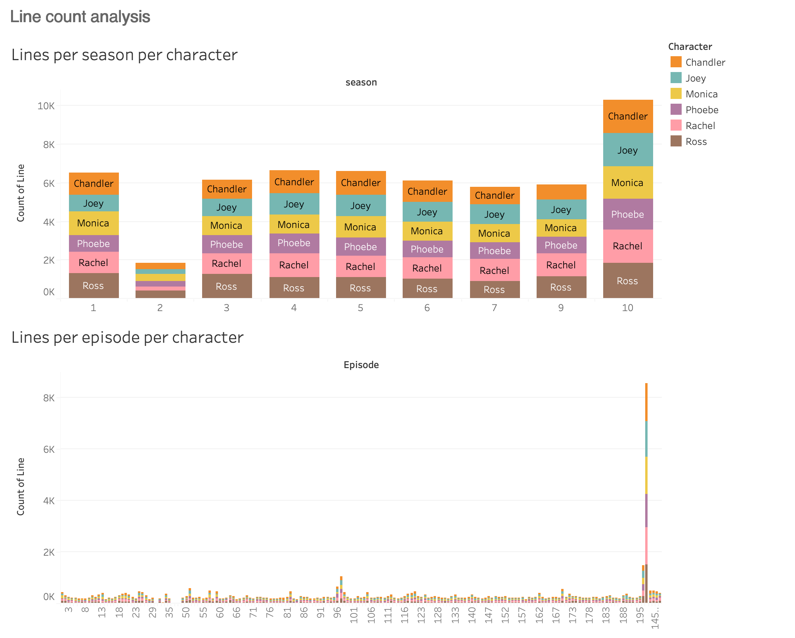
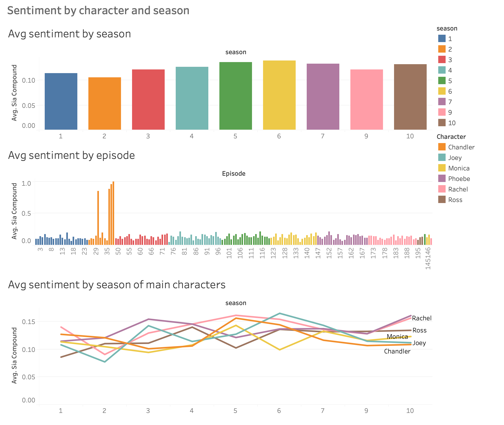
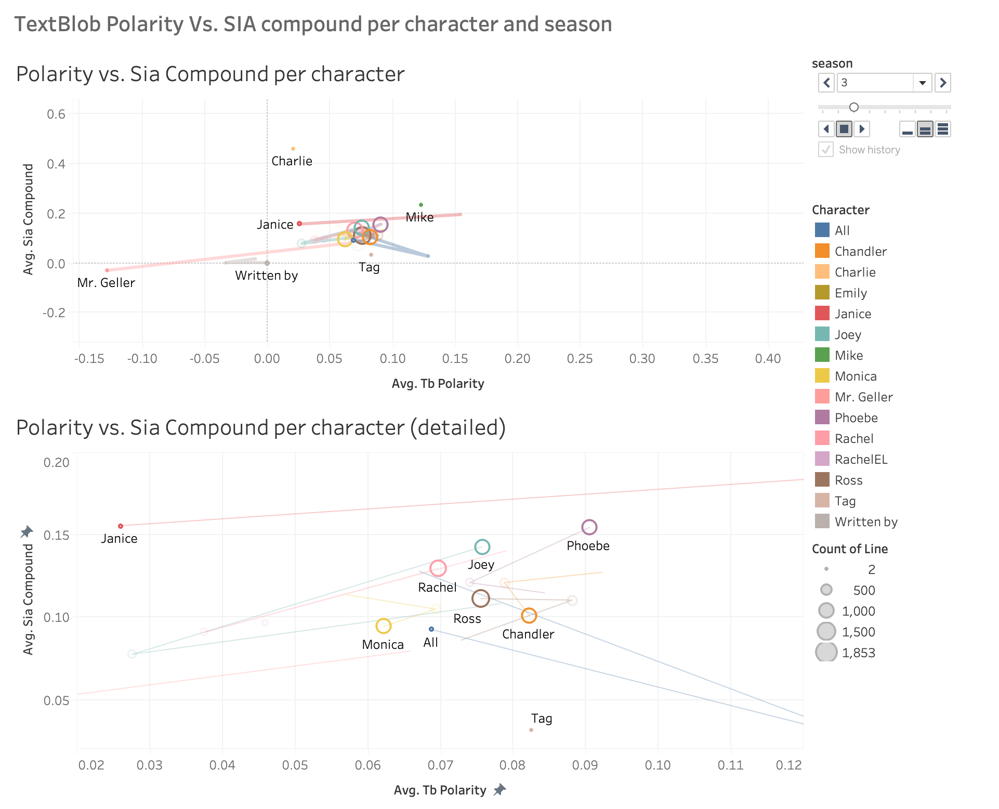

# project-IV-sql-tableau
## Project IV SQL - Tableau
## Andrés Castro

# Friends Script Analysis
 
This project analyzes the script of the TV show Friends using Python. The data is obtained from Kaggle and consists of a .txt file containing the full script of the TV Show. The file is processed to extract each line spoken by each character on every episode and obtains information about the season each episode belongs to along with every scene contained in every episode. Finally this information is processed to analyze the sentiment of every line. This information is then graphed using tabluea.

### The project performs the following tasks:

- Cleaning the script data
- Extracting scene information
- Matching episode names between season information extracted from Wikipedia and episode names in the script
- Processing and standarizing character names
- Performing sentiment analysis on the script using two different libraries (TextBlob and SentimentIntensityAnalyzer)
- Exporting the cleaned and analyzed data to CSV files
- Graphing using Tableau to gain insights

## Requirements

 
The project requires Python 3 and the following libraries:

- pandas
- numpy
- re
- textblob
- nltk
- vaderSentiment

## Usage
The script outputs three CSV files containing the cleaned and analyzed data:

script.csv: Contains the lines spoken by each character in each scene, along with the sentiment scores.
seasons.csv: Contains metadata for each episode, such as the episode number, title, air date, ratings and season it belongs to.
scenes.csv: Contains information about each scene, such as the episode number, scene number, and description of the scene. 
  
## Results
Using tableau the data was graphed to gain insights from the sentiment of characters, seasons, episodes, etc. To access the interactive dashboard please visit it directly from [Tableau Public](https://public.tableau.com/views/FriendsSentimentAnalysis/F_R_I_E_N_D_S_Sentimentanalysis?:language=en-US&publish=yes&:display_count=n&:origin=viz_share_link).

## Conclusions 
 
With this process we were able to go from a plain text file to an in-depth analysis of the sentiment of every character, their lines and how this evolved over the show's episodes and seasons. This information was presented visually and interactively.

## Areas for improvement 
 
Through the visual representations of the data we could see that there are some potential errors in the cleaning and processing of the script that could be improved upon:

1. TV script writting often has the same lines for multiple characters. This lines were not counted for every character because they were not processed to duplicate it for every character. In other words, often throughout the script we found instances of lines writtern as such: "Joey and Phoebe: Stop!". And this was interpreted by the script as a character called "Joey and Pheobe". These instances are not always written in the same way. The processing of the characters can be improved to include this factor and improve character recognition and line assignment.

2. It appears that the .txt file does not include every episode in the show. This could be the case but it could also be possible that they were not correctly separated in the processing. We can see in the visualizations that season 2 appears to be incomplete and that some later episodes appear to have many lines. The processing of the script can be improved to prevent these errors.

3. Some episodes of season 2 seem to have an off scale positive sentiment. This suggests that there is an error in the sentiment analysis of those episodes.